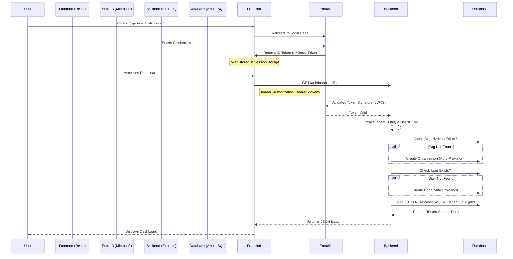

# Authentication Flow Diagram

```mermaid
sequenceDiagram
    participant User
    participant Frontend (React)
    participant EntraID (Microsoft)
    participant Backend (Express)
    participant Database (Azure SQL)

    User->>Frontend: Clicks "Sign in with Microsoft"
    Frontend->>EntraID: Redirects to Login Page
    User->>EntraID: Enters Credentials
    EntraID->>Frontend: Returns ID Token & Access Token
    
    Note over Frontend: Token stored in SessionStorage

    User->>Frontend: Accesses Dashboard
    Frontend->>Backend: GET /api/dashboard/stats
    Note right of Frontend: Header: Authorization: Bearer <token>

    Backend->>EntraID: Validates Token Signature (JWKS)
    EntraID-->>Backend: Token Valid
    
    Backend->>Backend: Extract TenantID (tid) & UserID (oid)
    
    Backend->>Database: Check Organization Exists?
    alt Org Not Found
        Backend->>Database: Create Organization (Auto-Provision)
    end

    Backend->>Database: Check User Exists?
    alt User Not Found
        Backend->>Database: Create User (Auto-Provision)
    end

    Backend->>Database: SELECT * FROM cases WHERE tenant_id = @tid
    Database-->>Backend: Returns Tenant-Scoped Data
    Backend-->>Frontend: Returns JSON Data
    Frontend-->>User: Displays Dashboard
```
